# 週次サムネイル生成テンプレート（デモ版）仕様書

リポジトリ名：**`weekly-thumbnail-template-demo`**

---

## 1. 概要

### 1.1 課題

週次で配信・投稿されるコンテンツのサムネイルは、回ごとに作り直されることで配色・文字サイズ・要素位置が少しずつ揺らぎ、シリーズとしての一貫性が失われる。本成果物は、**配色と配置を版面マスタとして固定し、週番号と話題の 2 つだけを差し替えて画像を得る**仕組みを、入力から書き出しまで体験できる展示物として提供するものである。

中核となるのは、可変要素が入っても版面が動かないことを保証する組版規則である。話題の文字数は回ごとに変動するため、素朴に流し込めば枠外へあふれ、中央揃えにすれば行数によって位置が動く。本成果物は、**スロット枠を不変とし、可変長要素の伸縮方向をアンカーで 1 方向に限定したうえで、枠内に収まる組版を決定的に導出する規則の集合**として定義する。同じ入力からは、いつ・何度実行しても同じ組版結果が得られることが提供価値の中核である。

### 1.2 対象エディション

**デモ版（アイデアの視覚化）**

技術と UX を体験させる展示物として、安全・手軽に動かせることを最優先する。デザイン・測定・保守・監視は対象外とする。

なお、4 軸の「デザインなし」は**アプリケーション画面の UI/UX を作り込まないこと**を指す。成果物であるサムネイルの配色・配置は、利用者が編集できない固定マスタとして本仕様に定義するものであり、この軸の対象外である。

### 1.3 成果物の位置づけ

本成果物は、**入力の検証・組版の導出・版面への描画・書き出し**を担う。テンプレート自体の作成・編集機能、画像素材（写真・イラスト）の取り込み、配信プラットフォームへの投稿は対象外とする。生成した画像はサーバに保存せず、**入力と組版結果のメタデータのみを保持し、そこから同一の画像を再現できる**ことをもって記録に代える。

---

## 2. プラットフォーム選定

### 2.1 ターゲットの判別

成果物を直接操作し、生成された画像を受け取るのは**人間**（シリーズの制作者・投稿担当者）である。よってターゲットは人間向けとする。

### 2.2 プラットフォーム

**ウェブ** を選択する。

- 週番号と話題という**入力に応じて出力（組版と画像）が変わる**ことが提供価値の中核であり、電子書籍・固定レイアウト出版物・動画は該当しない
- 入力に対して即座に版面を再描画し、収まり具合を目で確認しながら確定する体験が本成果物の要であり、静的な文書では代替できない
- 展示の場で URL を開くだけで体験でき、生成した PNG をその場で持ち帰れることが最も手軽である

### 2.3 構成方針

デモ版の簡略構成（Cloudflare 一本化）を **選択する**。本成果物は入力の検証・組版結果の保存・履歴表示という **CRUD と表示が主体**であり、描画はブラウザの Canvas API で完結するため、サーバー側に画像加工・AI・解析の処理を一切持たないためである。

| 層 | 技術 | デプロイ先 | 役割 |
|---|---|---|---|
| フロントエンド | Cloudflare Pages（TypeScript） | Cloudflare（無料） | 入力・プレビュー・検版・一括生成・履歴の各画面、Canvas 描画と PNG 書き出し |
| アプリケーション | Cloudflare Workers（TypeScript） | Cloudflare（無料） | 入力検証・組版導出・判定・履歴管理・セッション管理 |
| DB | D1（SQLite） | Cloudflare（無料） | セッション・生成結果・行・指摘・一括ジョブ・書き出し記録 |
| 定期実行 | Cron Triggers | Cloudflare（無料） | 日次リセット |
| 同梱資産 | 本文フォント（サブセット）、字幅テーブル | Cloudflare Pages（静的配信） | 組版と描画の決定性を担保する |

D1 は SQLite 互換のデータベースであり、「デモ版はどの環境でも SQLite を使用する」制約に適合する。Railway は使用しない。フォントは同一オリジンから配信し、外部のフォント配信サービスを参照しない。

---

## 3. 用語定義

| 用語 | 定義 |
|---|---|
| 版面 | テンプレートが定める画像全体の寸法と、その上の要素配置の総体 |
| テンプレート | 版面・パレット・スロット構成を一体で定めた固定マスタ。利用者は選択のみ行い、編集できない |
| パレット | テンプレートが用いる配色の集合。役割（背景・帯・主文字・副文字・アクセント）ごとに 1 色を定める |
| スロット | 版面上で内容を配置する矩形領域。位置・寸法は不変 |
| 固定スロット | 内容がマスタで定まり、入力によって変化しないスロット |
| 可変スロット | 入力によって内容が変わるスロット。週番号スロットと話題スロットの 2 つのみ |
| アンカー | 可変長の内容が伸縮する際に動かさない基準辺。伸縮方向を 1 方向に限定する |
| セーフマージン | 版面の外周に設ける、内容を置かない余白。一覧表示での切り落としに備える |
| 占有禁止領域 | 配信面の UI（再生時間バッジ等）が重なる前提で、内容を置かない領域 |
| 週番号 | 回を識別する 1 以上の整数。表示形式はテンプレートが定める |
| 話題 | その回の主題を表す短い文。可変スロットに流し込まれる |
| 正規化 | 入力文字列を、組版に用いる表記へ整える処理 |
| 収録文字 | 同梱フォントが字形を持つ文字の集合 |
| 字幅テーブル | 収録文字ごとの送り幅を記した同梱データ。組版計算の唯一の幅情報源 |
| 行分割 | 話題を、枠幅と禁則規則に従って複数行へ分ける処理 |
| 禁則 | 行頭・行末に置いてはならない文字、および分割してはならない連なりの規則 |
| 自動縮小 | 枠に収まる最大の文字サイズを、候補サイズの降順から選ぶ処理 |
| 組版結果 | 採用文字サイズ・行数・各行の文字列・各行の基準位置の組。同一入力から一意に定まる |
| 検版 | 書き出し前に、はみ出し・可読性・コントラスト・領域侵犯を確認する工程 |
| 判定 | 検版の結論。適合・注意付き適合・不適合の 3 値 |
| 改訂 | 同一テンプレート・同一週番号に対する再生成。上書きせず版を重ねる |
| セッションキー | ブラウザごとに発行される不透明識別子。DB レコードのオーナーキー |

---

## 4. スコープ

### 4.1 対象

- テンプレートの選択と、版面・パレット・スロット構成の提示
- 週番号の入力・正規化・検証、および日付からの週番号算出と履歴からの自動採番
- 話題の入力・正規化・収録文字の検査
- 禁則規則に従った行分割と、枠に収まる文字サイズの決定
- アンカーに基づく配置計算と、版面への描画
- 検版（はみ出し・縮小時可読性・グレースケール可読性・セーフマージン・占有禁止領域）と 3 値判定
- 不適合時の理由提示と、収まる文字数の目安の提示
- 一括入力による複数回分の一括検証・一括生成
- 生成履歴の保持と、履歴からの同一画像の再現
- PNG の書き出し、および一括書き出し

### 4.2 対象外

- テンプレート（版面・パレット・スロット）の作成・編集・追加
- 写真・イラスト・ロゴ画像の取り込みと合成
- 生成画像そのもののサーバ保存
- 配信プラットフォームへの投稿、予約投稿、外部サービス連携
- 話題の自動生成・要約・翻訳
- ユーザー認証・認可、複数人での共同編集
- 印刷用途（CMYK・塗り足し）への対応

---

## 5. システム構成

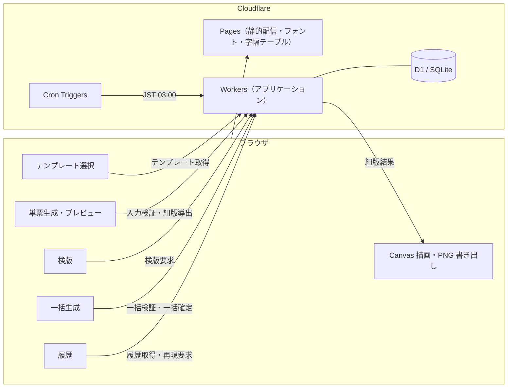
```mermaid
flowchart LR
  subgraph BR["ブラウザ"]
    UI1["テンプレート選択"]
    UI2["単票生成・プレビュー"]
    UI3["検版"]
    UI4["一括生成"]
    UI5["履歴"]
    CV["Canvas 描画・PNG 書き出し"]
  end

  subgraph CF["Cloudflare"]
    PG["Pages（静的配信・フォント・字幅テーブル）"]
    WK["Workers（アプリケーション）"]
    D1[("D1 / SQLite")]
    CR["Cron Triggers"]
  end

  BR --> PG
  UI1 -->|"テンプレート取得"| WK
  UI2 -->|"入力検証・組版導出"| WK
  UI3 -->|"検版要求"| WK
  UI4 -->|"一括検証・一括確定"| WK
  UI5 -->|"履歴取得・再現要求"| WK
  WK -->|"組版結果"| CV
  WK --- D1
  CR -->|"JST 03:00"| WK
```

---

## 6. テンプレート仕様

### 6.1 全体方針

- テンプレートは版面・パレット・スロット構成を一体で定める固定マスタとする。アプリケーションに同梱し、DB には保存しない
- スロットの位置と寸法は、入力の内容によらず不変であること
- 可変スロットの内容は、アンカーで定めた 1 方向にのみ伸縮すること。両方向へ伸びる配置（中央揃えによる上下伸長を含む）を用いないこと
- 色は必ずパレットの役割から参照すること。色値を個別の要素に直接指定しないこと
- 同一の入力からは、同一の組版結果が得られること

### 6.2 版面マスタ

| コード | 用途 | 版面（px） | セーフマージン | 占有禁止領域 |
|---|---|---|---|---|
| T01 | 動画サムネイル（16:9） | 1280 × 720 | 48 | 右下 150 × 60 |
| T02 | 記事・リンクカード | 1200 × 630 | 48 | なし |
| T03 | 正方形の告知 | 1080 × 1080 | 56 | なし |

### 6.3 パレット（全テンプレート共通・固定）

| 役割 | 色 | 用途 |
|---|---|---|
| 背景 | `#0F1B2B` | 版面全体の下地 |
| 帯 | `#1C3A5E` | 話題スロットの背面に敷く矩形 |
| 主文字 | `#FFFFFF` | 話題 |
| 副文字 | `#A8C4E0` | シリーズ名 |
| アクセント | `#FFC24B` | 週番号、固定マーク |

**要件**

- 主文字と背面色のコントラスト比は 7:1 以上、副文字・アクセントと背面色のコントラスト比は 4.5:1 以上であること
- グレースケールへ変換した後も、可変スロットの文字と背面色のコントラスト比が 3:1 以上であること
- 色のみで意味を区別する表現を版面に置かないこと
- パレットは利用者に開示するが、変更操作を設けないこと

### 6.4 スロット構成（T01 の例）

座標は版面左上を原点とし、単位は px とする。

| コード | 種別 | 内容 | 枠（x, y, w, h） | アンカー | 色の役割 |
|---|---|---|---|---|---|
| S-BG | 固定 | 背景の塗り | 0, 0, 1280, 720 | — | 背景 |
| S-BAND | 固定 | 話題の背面帯 | 0, 176, 1280, 448 | — | 帯 |
| S-SERIES | 固定 | シリーズ名（マスタ文字列） | 64, 48, 640, 48 | 左上 | 副文字 |
| S-WEEK | **可変** | 週番号 | 704, 48, 512, 72 | **右上** | アクセント |
| S-TOPIC | **可変** | 話題 | 64, 208, 1152, 384 | **左上** | 主文字 |
| S-MARK | 固定 | 固定マーク（幾何図形） | 64, 616, 56, 56 | 左下 | アクセント |

T02・T03 は版面比率に応じて同じ構成を持ち、スロットの寸法のみが異なる。いずれのテンプレートでも可変スロットは S-WEEK と S-TOPIC の 2 つのみとする。

### 6.5 可変スロットの組版パラメータ

| テンプレート | スロット | 最大サイズ | 最小サイズ | 刻み | 最大行数 | 行送り係数 | 字間 |
|---|---|---|---|---|---|---|---|
| T01 | S-TOPIC | 128 | 64 | 4 | 3 | 1.35 | 0.02em |
| T01 | S-WEEK | 64 | 64 | — | 1 | — | 0.04em |
| T02 | S-TOPIC | 112 | 56 | 4 | 3 | 1.35 | 0.02em |
| T02 | S-WEEK | 56 | 56 | — | 1 | — | 0.04em |
| T03 | S-TOPIC | 120 | 60 | 4 | 4 | 1.35 | 0.02em |
| T03 | S-WEEK | 60 | 60 | — | 1 | — | 0.04em |

**要件**

- 最小サイズは、縮小表示時の可読性下限（9.3）から導かれる値以上であること
- 週番号スロットは自動縮小を行わない。表示可能な桁数の上限（7.2）により幅が保証されるためである
- 行送り係数・字間はテンプレートごとの固定値とし、収まりの調整に用いないこと

### 6.6 マスタデータ件数

| 区分 | 件数 |
|---|---|
| テンプレート | 3 |
| パレットの役割 | 5 |
| スロット（テンプレートあたり） | 6 |
| 可変スロット（テンプレートあたり） | 2 |
| 行頭禁則文字 | 42 |
| 行末禁則文字 | 16 |
| 分離禁止の連なり規則 | 5 |
| 正規化規則 | 6 |
| 検版項目 | 7 |
| 判定結果 | 3 |
| 指摘コード | 14 |
| 週番号の表示形式 | 3 |
| 一括入力の上限行数 | 50 |

---

## 7. 入力仕様

### 7.1 入力項目

| 項目 | 必須 | 入力方法 |
|---|---|---|
| テンプレート | 必須 | 3 種から単一選択 |
| 週番号 | 必須 | 直接入力、日付からの算出、履歴からの自動採番のいずれか |
| 話題 | 必須 | 自由入力（明示改行を含めてよい） |

### 7.2 週番号

| 項目 | 内容 |
|---|---|
| 受理範囲 | 1 以上 999 以下の整数 |
| 正規化 | 全角数字を半角へ変換する。前後の空白を除去する |
| 不受理 | 0、負数、1000 以上、小数、数字以外を含む値 |
| 表示形式 | テンプレートが定める固定の接頭辞と、ゼロ埋め 2 桁（100 以上は 3 桁）の数字 |
| 日付からの算出 | 入力された日付の ISO 8601 週番号（1〜53）を初期値とする。日付そのものは保存しない |
| 自動採番 | 同一テンプレートの履歴における最大の週番号に 1 を加えた値を初期値とする。履歴が無い場合は 1 とする |
| 重複 | 同一テンプレート・同一週番号の履歴が存在する場合、注意付き適合とし、改訂として生成するかを選択させる |

**要件**

- 週番号スロットの枠は 3 桁表示時の幅を確保し、桁数が変わっても枠を変更しないこと
- 接頭辞と数字は一体で右アンカーに揃え、桁数の増減は左方向にのみ伸びること

### 7.3 話題

| 項目 | 内容 |
|---|---|
| 受理文字数 | 1 以上 60 以下（正規化後、明示改行を除く） |
| 明示改行 | 最大行数 − 1 個まで受理する。超過は不適合 |
| 収録文字 | 同梱フォントが字形を持つ文字のみを受理する |

**正規化規則**

| 順 | 規則 |
|---|---|
| 1 | 制御文字（改行を除く）を除去する |
| 2 | 改行コードを統一し、連続する改行を 1 個にまとめる |
| 3 | 全角空白を半角空白へ変換する |
| 4 | 連続する空白を 1 個にまとめる |
| 5 | 文字列の前後、および各行の前後の空白を除去する |
| 6 | 半角カタカナを全角カタカナへ変換する |

**要件**

- 全角英数字を半角へ変換しないこと。表記の意図を保つためである
- 収録文字の範囲外を含む場合は不適合とし、該当文字を位置とともに提示すること。代替字形での描画（豆腐の表示を含む）を行わないこと
- 話題を自動的に切り詰めないこと。省略記号の付与は利用者の明示操作による場合に限ること

---

## 8. 組版仕様

### 8.1 幅の算出

- 文字の送り幅は、同梱の字幅テーブルからのみ取得すること。描画環境の計測 API に依存しないこと
- 行の幅は、各文字の送り幅の総和に、字間×（文字数 − 1）を加えた値とすること
- 実行環境が異なっても、同一入力から同一の組版結果（採用サイズ・行分割）が得られること

### 8.2 行分割

| 順 | 処理 |
|---|---|
| 1 | 明示改行で段落へ分ける。段落の境界をまたぐ行の結合を行わない |
| 2 | 各段落を先頭から走査し、枠幅を超える直前の位置を分割候補とする |
| 3 | 分割候補が禁則に抵触する場合、抵触しない位置まで前方へ戻す |
| 4 | 前方へ戻せる位置が無い場合、その文字は 1 行に収まらないものとして扱い、不適合とする |

**禁則**

| 区分 | 内容 |
|---|---|
| 行頭禁則 | 句読点・閉じ括弧・中黒・長音記号・繰り返し記号・小書き仮名・感嘆符・疑問符・コロン・セミコロン |
| 行末禁則 | 開き括弧 |
| 分離禁止 | 連続する半角英数字、数値と直後の単位、連続する感嘆符・疑問符、三点リーダの連なり、ダッシュの連なり |
| ぶら下げ | 行末に来た句読点は 1 文字までぶら下げてよく、その分の幅を行幅に算入しない |

### 8.3 自動縮小

| 順 | 処理 |
|---|---|
| 1 | 最大サイズから最小サイズまで、刻み幅で降順に候補サイズを並べる |
| 2 | 候補サイズごとに行分割を行い、行数・各行幅・総高を算出する |
| 3 | 行数が最大行数以下、各行幅が枠幅以下、総高（行数 × サイズ × 行送り係数）が枠高以下の全てを満たす最初の候補を採用する |
| 4 | 最小サイズでも満たせない場合、不適合とし、最小サイズで収まる文字数の目安を併せて提示する |

**要件**

- 刻みの外のサイズを採用しないこと。連続値での微調整を行わないこと
- 採用サイズ・行数・各行の文字列を組版結果として保存し、再描画時に同じ値を用いること

### 8.4 配置

| 順 | 処理 |
|---|---|
| 1 | スロット枠を不変の矩形として確定する |
| 2 | 話題スロットは左上アンカーとし、1 行目の上端を枠上端に合わせ、以降の行を行送り分だけ下へ積む |
| 3 | 週番号スロットは右上アンカーとし、表示文字列の右端を枠右端に合わせる |
| 4 | 固定スロットはマスタの座標へそのまま配置する |

**要件**

- 行数の増減によってスロット枠の位置・寸法が変化しないこと
- 行数の増減による内容の伸長方向が、アンカーの反対方向の 1 方向のみであること
- 版面の中央揃えによる上下方向の伸長を用いないこと

### 8.5 描画

| 順 | 描画対象 |
|---|---|
| 1 | 背景（S-BG） |
| 2 | 帯（S-BAND） |
| 3 | 固定マーク（S-MARK） |
| 4 | シリーズ名（S-SERIES） |
| 5 | 週番号（S-WEEK） |
| 6 | 話題（S-TOPIC） |

**要件**

- 描画順を固定し、乱数・現在時刻・実行回数に依存する値を用いないこと
- 内部の描画倍率を固定値とし、表示端末の画素密度に依存しないこと
- 同梱フォントの読み込み完了を待って描画を開始すること。代替フォントでの描画を行わないこと

---

## 9. 検版・判定仕様

### 9.1 検版項目

| コード | 項目 | 内容 |
|---|---|---|
| V1 | 枠内収容 | 各行の幅が枠幅以下、総高が枠高以下であること |
| V2 | サイズ下限 | 採用サイズが最小サイズ以上であること |
| V3 | セーフマージン | 全ての内容がセーフマージンの内側にあること |
| V4 | 占有禁止領域 | 占有禁止領域に内容が重ならないこと |
| V5 | 縮小時可読性 | 一覧表示幅への縮小時の実効文字サイズが下限以上であること |
| V6 | コントラスト | 可変スロットの文字と背面色のコントラストが下限以上であること |
| V7 | グレースケール | グレースケール変換後もコントラストが下限以上であること |

### 9.2 判定規則

| 順 | 条件 | 判定 |
|---|---|---|
| 1 | 検版項目に 1 つでも未達がある、または入力が不受理である | **不適合** |
| 2 | 全項目を満たすが、注意条件に該当する | **注意付き適合** |
| 3 | 全項目を満たし、注意条件に該当しない | **適合** |

**注意条件**

| 条件 | 内容 |
|---|---|
| 最小サイズに接近 | 採用サイズが最小サイズから 1 段以内である |
| 週番号の重複 | 同一テンプレート・同一週番号の履歴が既に存在する |
| 行長の偏り | 最短行の幅が最長行の幅の 40% 未満である |
| 極端に短い話題 | 正規化後の文字数が 2 以下である |

**要件**

- 判定は、入力・組版結果・テンプレートのマスタ値のみから導かれること。人手による上書きを設けないこと
- 不適合の判定結果には、未達の検版項目と入力上の原因を全て列挙すること
- 不適合の判定結果には、最小サイズで収まる文字数の目安、または削減すべき文字数を併せて示すこと
- 注意付き適合は書き出しを妨げないこと。注意の内容を書き出しまで表示し続けること

### 9.3 可読性の下限

| 項目 | 値 |
|---|---|
| 一覧表示の想定幅 | 360 px |
| 超縮小表示の想定幅 | 210 px |
| 実効文字サイズの下限（一覧表示幅換算） | 14 px |
| 週番号の実効文字サイズの下限（超縮小表示幅換算） | 8 px |

実効文字サイズは、採用サイズに（想定幅 ÷ 版面横幅）を乗じた値とする。話題スロットの最小サイズは、この下限を満たす値としてテンプレートごとに定める。

### 9.4 検版の提示

- 原寸、一覧表示幅、超縮小表示幅、グレースケールの 4 通りの見えを同一画面で提示すること
- セーフマージンと占有禁止領域を重ね表示で切り替えられること
- 検版の提示は組版結果からの再描画によって行い、別経路の描画を持たないこと

---

## 10. 一括生成仕様

| 項目 | 内容 |
|---|---|
| 入力形式 | 1 行 1 件。1 列目を週番号、2 列目を話題とし、タブで区切る |
| 上限 | 50 行 |
| テンプレート | 一括ジョブ単位で 1 種を選択する。行ごとの指定は行わない |
| 検証 | 全行について単票と同一の規則で検証し、行ごとに判定と指摘を提示する |
| 確定 | 適合および注意付き適合の行のみを確定できる。不適合行は入力として残す |
| 重複 | ジョブ内での週番号の重複、および履歴との重複をそれぞれ注意として提示する |
| 書き出し | 確定した行をまとめて書き出す。個別の書き出しも行える |

**要件**

- 一括の検証結果は、単票で同じ入力を与えた場合の結果と一致すること
- 行の欠落・列の不足・上限超過は、ジョブ全体を不受理とせず、該当行の指摘として提示すること
- 一括処理中に外部への通信を行わないこと

---

## 11. 履歴・改訂・書き出し仕様

### 11.1 履歴

- 確定した生成は、入力と組版結果を伴って履歴に保存すること
- 画像そのものを保存しないこと。履歴の再現は、保存した組版結果からの再描画によって行うこと
- 履歴からの再現結果が、確定時の組版結果と一致すること

### 11.2 改訂

- 同一テンプレート・同一週番号に対する再生成は、上書きせず改訂番号を進めて追加すること
- 履歴は改訂番号の降順で提示し、過去の改訂も再現できること

### 11.3 書き出し

| 項目 | 内容 |
|---|---|
| 形式 | PNG（版面の実寸） |
| ファイル名 | テンプレートコード、ゼロ埋め 3 桁の週番号、改訂番号から機械的に組み立てる |
| 一括 | 確定済みの複数件を 1 つの書庫にまとめて書き出す |
| 記録 | 書き出しの実施を履歴に記録する |

**要件**

- ファイル名に話題の文字列を含めないこと。長さと使用文字が環境により問題となるためである
- 書き出しはブラウザ内で完結し、生成画像をサーバへ送信しないこと
- 書庫の生成に外部への通信を伴うライブラリを用いないこと

---

## 12. 画面仕様

### 12.1 テンプレート選択画面

| 領域 | 内容 |
|---|---|
| 一覧 | 3 種のテンプレートを版面比率の見本とともに表示する |
| 仕様表示 | 選択中のテンプレートの版面・パレット・可変スロットの位置と上限文字数を表示する |
| 注意 | 配色と配置は編集できない旨を表示する |

### 12.2 単票生成画面

| 領域 | 内容 |
|---|---|
| 週番号 | 直接入力、日付からの算出、自動採番の 3 通りの入力口を持つ |
| 話題 | 自由入力。正規化後の文字数と残り文字数を表示する |
| プレビュー | 入力の変更に同期して版面を再描画する |
| 組版情報 | 採用サイズ・行数・各行の文字列を表示する |
| 判定 | 判定結果と指摘を一覧表示する。不適合の場合は削減すべき文字数を併記する |
| 操作 | 確定、書き出し、検版画面への移動 |

### 12.3 検版画面

| 領域 | 内容 |
|---|---|
| 見え比較 | 原寸・一覧表示幅・超縮小表示幅・グレースケールを並べて表示する |
| 重ね表示 | セーフマージン、占有禁止領域、スロット枠の表示を切り替える |
| 検版結果 | 検版項目ごとの充足状況を表示する |

### 12.4 一括生成画面

| 領域 | 内容 |
|---|---|
| 入力 | 貼り付け用の複数行入力欄。形式の説明を併記する |
| 行一覧 | 行ごとに週番号・話題・判定・指摘・採用サイズ・行数を表示する |
| 縮小プレビュー | 行を選択すると版面を表示する |
| 操作 | 適合行の一括確定、一括書き出し |

### 12.5 履歴画面

| 領域 | 内容 |
|---|---|
| 一覧 | テンプレート・週番号・改訂番号・判定・確定時刻を表示する |
| 再現 | 選択した履歴から版面を再描画して表示する |
| 書き出し | 履歴からの再書き出しを行う |
| 注意 | 当日限りで消去される旨を常時表示する |

---

## 13. データ設計

### 13.1 テーブル一覧

| テーブル | 用途 |
|---|---|
| sessions | ブラウザごとのセッション |
| generations | 確定した生成 1 件（入力と組版結果の要約） |
| generation_lines | 組版結果の行 |
| findings | 検版・入力検証の指摘 |
| batches | 一括ジョブ |
| batch_items | 一括ジョブの行 |
| exports | 書き出しの記録 |

テンプレート・パレット・スロット・禁則規則・正規化規則・字幅テーブルはアプリケーションに同梱する固定データとし、DB には保存しない。生成画像も保存しない。

すべてのテーブルは `session_id` を保持し、オーナーキーとして参照条件に必ず含める。

---

## 14. ER図

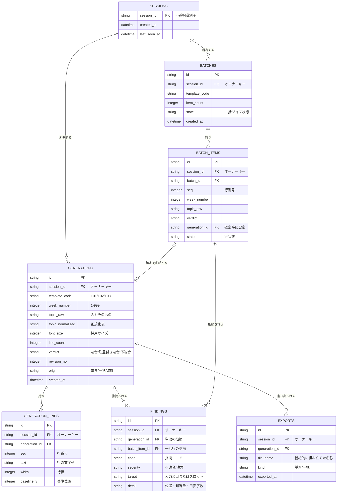
```mermaid
erDiagram
  SESSIONS ||--o{ GENERATIONS : "所有する"
  SESSIONS ||--o{ BATCHES : "所有する"
  GENERATIONS ||--o{ GENERATION_LINES : "持つ"
  GENERATIONS ||--o{ FINDINGS : "指摘される"
  GENERATIONS ||--o{ EXPORTS : "書き出される"
  BATCHES ||--o{ BATCH_ITEMS : "持つ"
  BATCH_ITEMS ||--o{ FINDINGS : "指摘される"
  BATCH_ITEMS |o--o| GENERATIONS : "確定で生成する"

  SESSIONS {
    string session_id PK "不透明識別子"
    datetime created_at
    datetime last_seen_at
  }

  GENERATIONS {
    string id PK
    string session_id FK "オーナーキー"
    string template_code "T01/T02/T03"
    integer week_number "1-999"
    string topic_raw "入力そのもの"
    string topic_normalized "正規化後"
    integer font_size "採用サイズ"
    integer line_count
    string verdict "適合/注意付き適合/不適合"
    integer revision_no
    string origin "単票/一括/改訂"
    datetime created_at
  }

  GENERATION_LINES {
    string id PK
    string session_id FK "オーナーキー"
    string generation_id FK
    integer seq "行番号"
    string text "行の文字列"
    integer width "行幅"
    integer baseline_y "基準位置"
  }

  FINDINGS {
    string id PK
    string session_id FK "オーナーキー"
    string generation_id FK "単票の指摘"
    string batch_item_id FK "一括行の指摘"
    string code "指摘コード"
    string severity "不適合/注意"
    string target "入力項目またはスロット"
    string detail "位置・超過量・目安字数"
  }

  BATCHES {
    string id PK
    string session_id FK "オーナーキー"
    string template_code
    integer item_count
    string state "一括ジョブ状態"
    datetime created_at
  }

  BATCH_ITEMS {
    string id PK
    string session_id FK "オーナーキー"
    string batch_id FK
    integer seq "行番号"
    integer week_number
    string topic_raw
    string verdict
    string generation_id FK "確定時に設定"
    string state "行状態"
  }

  EXPORTS {
    string id PK
    string session_id FK "オーナーキー"
    string generation_id FK
    string file_name "機械的に組み立てた名称"
    string kind "単票/一括"
    datetime exported_at
  }
```

---

## 15. DFD

### 15.1 コンテキストレベル

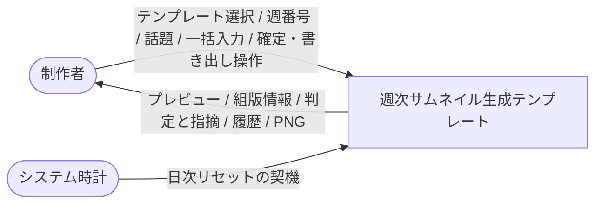
```mermaid
flowchart LR
  OP(["制作者"])
  CK(["システム時計"])

  P0["週次サムネイル生成テンプレート"]

  OP -->|"テンプレート選択 / 週番号 / 話題 / 一括入力 / 確定・書き出し操作"| P0
  P0 -->|"プレビュー / 組版情報 / 判定と指摘 / 履歴 / PNG"| OP
  CK -->|"日次リセットの契機"| P0
```

### 15.2 詳細レベル

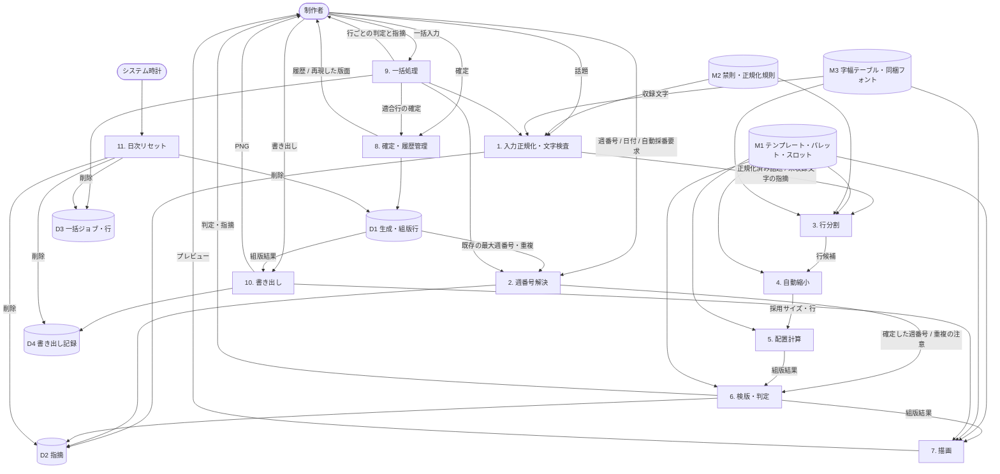
```mermaid
flowchart TB
  OP(["制作者"])
  CK(["システム時計"])

  P1["1. 入力正規化・文字検査"]
  P2["2. 週番号解決"]
  P3["3. 行分割"]
  P4["4. 自動縮小"]
  P5["5. 配置計算"]
  P6["6. 検版・判定"]
  P7["7. 描画"]
  P8["8. 確定・履歴管理"]
  P9["9. 一括処理"]
  P10["10. 書き出し"]
  P11["11. 日次リセット"]

  M1[("M1 テンプレート・パレット・スロット")]
  M2[("M2 禁則・正規化規則")]
  M3[("M3 字幅テーブル・同梱フォント")]
  D1[("D1 生成・組版行")]
  D2[("D2 指摘")]
  D3[("D3 一括ジョブ・行")]
  D4[("D4 書き出し記録")]

  OP -->|"話題"| P1
  M2 --> P1
  M3 -->|"収録文字"| P1
  P1 -->|"正規化済み話題 / 未収録文字の指摘"| P3
  P1 --> D2

  OP -->|"週番号 / 日付 / 自動採番要求"| P2
  D1 -->|"既存の最大週番号・重複"| P2
  P2 -->|"確定した週番号 / 重複の注意"| P6
  P2 --> D2

  M1 --> P3
  M2 --> P3
  M3 --> P3
  P3 -->|"行候補"| P4
  M1 --> P4
  P4 -->|"採用サイズ・行"| P5
  M1 --> P5
  P5 -->|"組版結果"| P6

  M1 --> P6
  P6 -->|"判定・指摘"| OP
  P6 --> D2
  P6 -->|"組版結果"| P7

  M1 --> P7
  M3 --> P7
  P7 -->|"プレビュー"| OP

  OP -->|"確定"| P8
  P8 --> D1
  P8 -->|"履歴 / 再現した版面"| OP

  OP -->|"一括入力"| P9
  P9 --> P1
  P9 --> P2
  P9 --> D3
  P9 -->|"行ごとの判定と指摘"| OP
  P9 -->|"適合行の確定"| P8

  OP -->|"書き出し"| P10
  D1 -->|"組版結果"| P10
  P10 --> P7
  P10 -->|"PNG"| OP
  P10 --> D4

  CK --> P11
  P11 -->|"削除"| D1
  P11 -->|"削除"| D2
  P11 -->|"削除"| D3
  P11 -->|"削除"| D4
```

---

## 16. シーケンス図

### 16.1 単票生成（適合）

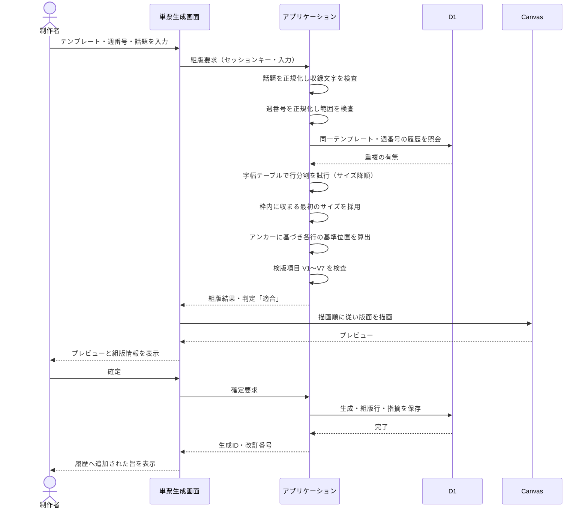
```mermaid
sequenceDiagram
  actor OP as 制作者
  participant UI as 単票生成画面
  participant AP as アプリケーション
  participant DB as D1
  participant CV as Canvas

  OP->>UI: テンプレート・週番号・話題を入力
  UI->>AP: 組版要求（セッションキー・入力）
  AP->>AP: 話題を正規化し収録文字を検査
  AP->>AP: 週番号を正規化し範囲を検査
  AP->>DB: 同一テンプレート・週番号の履歴を照会
  DB-->>AP: 重複の有無
  AP->>AP: 字幅テーブルで行分割を試行（サイズ降順）
  AP->>AP: 枠内に収まる最初のサイズを採用
  AP->>AP: アンカーに基づき各行の基準位置を算出
  AP->>AP: 検版項目 V1〜V7 を検査
  AP-->>UI: 組版結果・判定「適合」
  UI->>CV: 描画順に従い版面を描画
  CV-->>UI: プレビュー
  UI-->>OP: プレビューと組版情報を表示
  OP->>UI: 確定
  UI->>AP: 確定要求
  AP->>DB: 生成・組版行・指摘を保存
  DB-->>AP: 完了
  AP-->>UI: 生成ID・改訂番号
  UI-->>OP: 履歴へ追加された旨を表示
```

### 16.2 不適合（話題が収まらない）

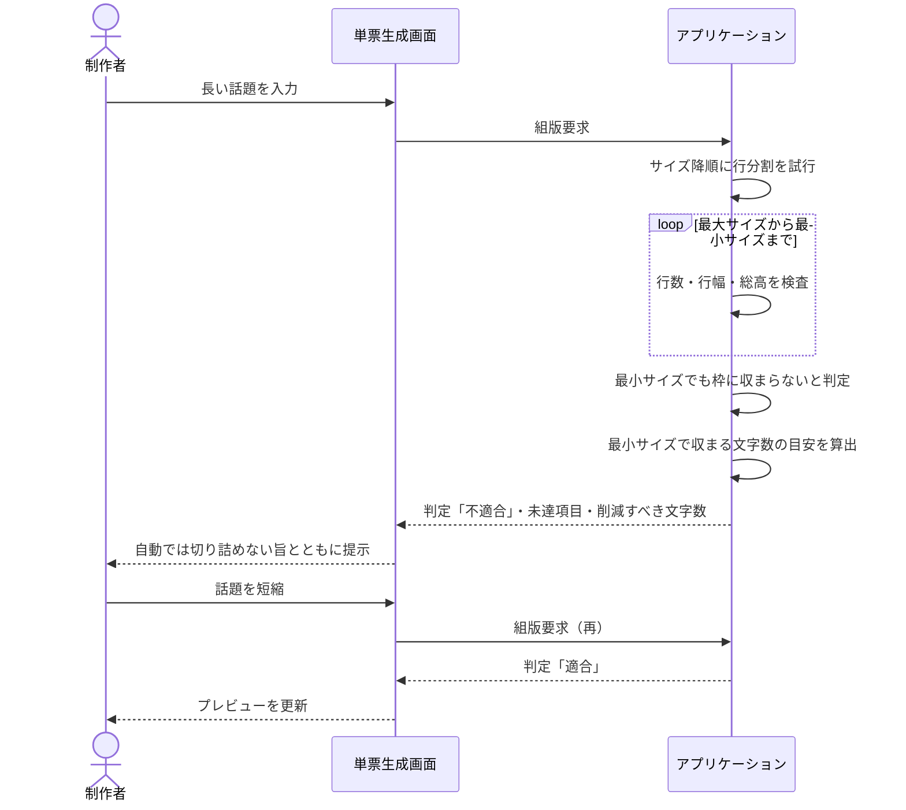
```mermaid
sequenceDiagram
  actor OP as 制作者
  participant UI as 単票生成画面
  participant AP as アプリケーション

  OP->>UI: 長い話題を入力
  UI->>AP: 組版要求
  AP->>AP: サイズ降順に行分割を試行
  loop 最大サイズから最小サイズまで
    AP->>AP: 行数・行幅・総高を検査
  end
  AP->>AP: 最小サイズでも枠に収まらないと判定
  AP->>AP: 最小サイズで収まる文字数の目安を算出
  AP-->>UI: 判定「不適合」・未達項目・削減すべき文字数
  UI-->>OP: 自動では切り詰めない旨とともに提示
  OP->>UI: 話題を短縮
  UI->>AP: 組版要求（再）
  AP-->>UI: 判定「適合」
  UI-->>OP: プレビューを更新
```

### 16.3 一括生成

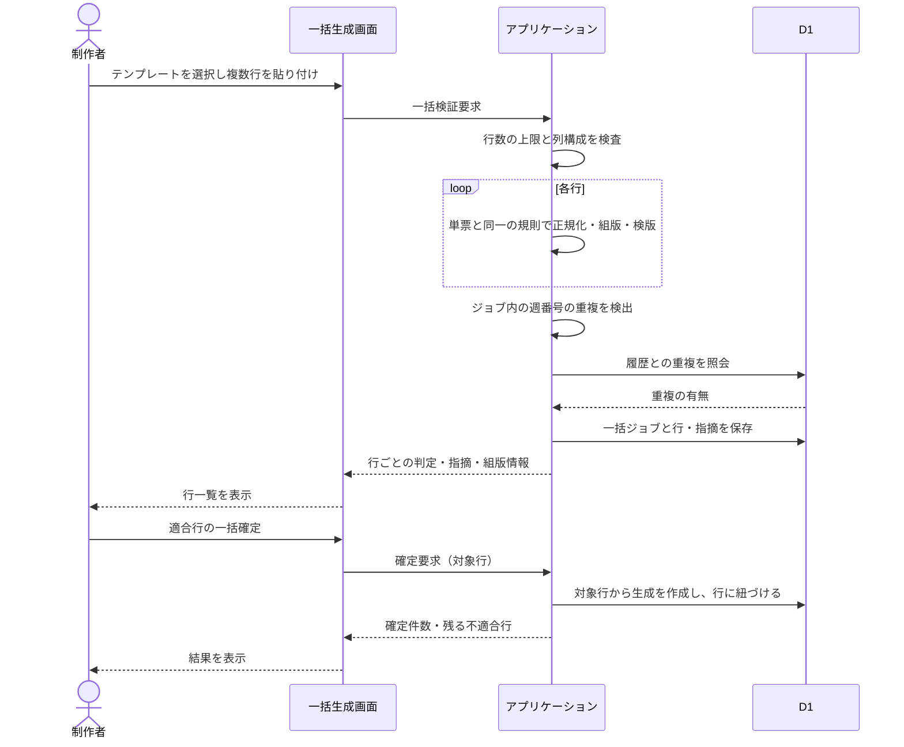
```mermaid
sequenceDiagram
  actor OP as 制作者
  participant UI as 一括生成画面
  participant AP as アプリケーション
  participant DB as D1

  OP->>UI: テンプレートを選択し複数行を貼り付け
  UI->>AP: 一括検証要求
  AP->>AP: 行数の上限と列構成を検査
  loop 各行
    AP->>AP: 単票と同一の規則で正規化・組版・検版
  end
  AP->>AP: ジョブ内の週番号の重複を検出
  AP->>DB: 履歴との重複を照会
  DB-->>AP: 重複の有無
  AP->>DB: 一括ジョブと行・指摘を保存
  AP-->>UI: 行ごとの判定・指摘・組版情報
  UI-->>OP: 行一覧を表示
  OP->>UI: 適合行の一括確定
  UI->>AP: 確定要求（対象行）
  AP->>DB: 対象行から生成を作成し、行に紐づける
  AP-->>UI: 確定件数・残る不適合行
  UI-->>OP: 結果を表示
```

### 16.4 履歴からの再現と書き出し

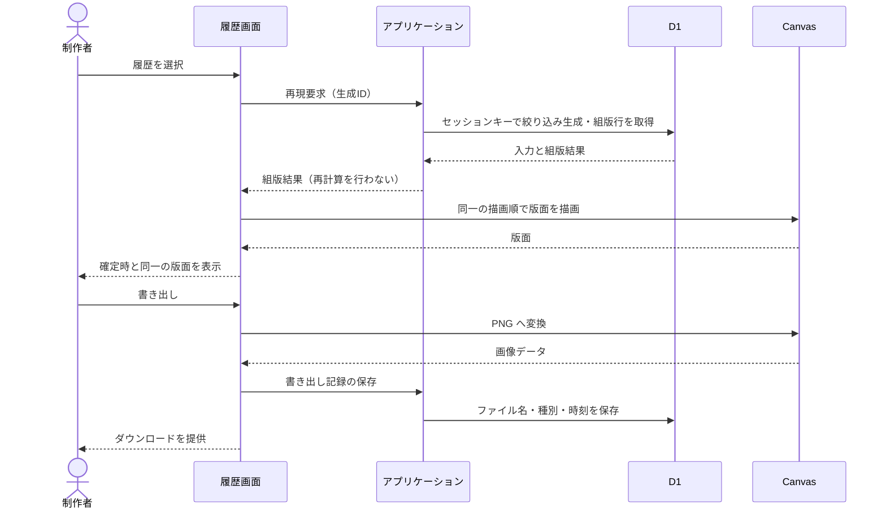
```mermaid
sequenceDiagram
  actor OP as 制作者
  participant UI as 履歴画面
  participant AP as アプリケーション
  participant DB as D1
  participant CV as Canvas

  OP->>UI: 履歴を選択
  UI->>AP: 再現要求（生成ID）
  AP->>DB: セッションキーで絞り込み生成・組版行を取得
  DB-->>AP: 入力と組版結果
  AP-->>UI: 組版結果（再計算を行わない）
  UI->>CV: 同一の描画順で版面を描画
  CV-->>UI: 版面
  UI-->>OP: 確定時と同一の版面を表示
  OP->>UI: 書き出し
  UI->>CV: PNG へ変換
  CV-->>UI: 画像データ
  UI->>AP: 書き出し記録の保存
  AP->>DB: ファイル名・種別・時刻を保存
  UI-->>OP: ダウンロードを提供
```

### 16.5 日次リセット

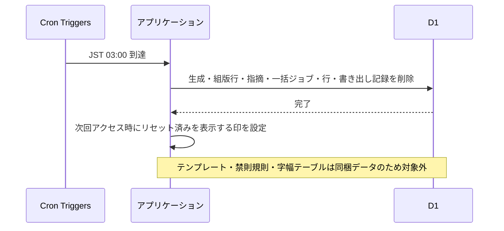
```mermaid
sequenceDiagram
  participant CK as Cron Triggers
  participant AP as アプリケーション
  participant DB as D1

  CK->>AP: JST 03:00 到達
  AP->>DB: 生成・組版行・指摘・一括ジョブ・行・書き出し記録を削除
  DB-->>AP: 完了
  AP->>AP: 次回アクセス時にリセット済みを表示する印を設定
  note over AP,DB: テンプレート・禁則規則・字幅テーブルは同梱データのため対象外
```

---

## 17. クラス図

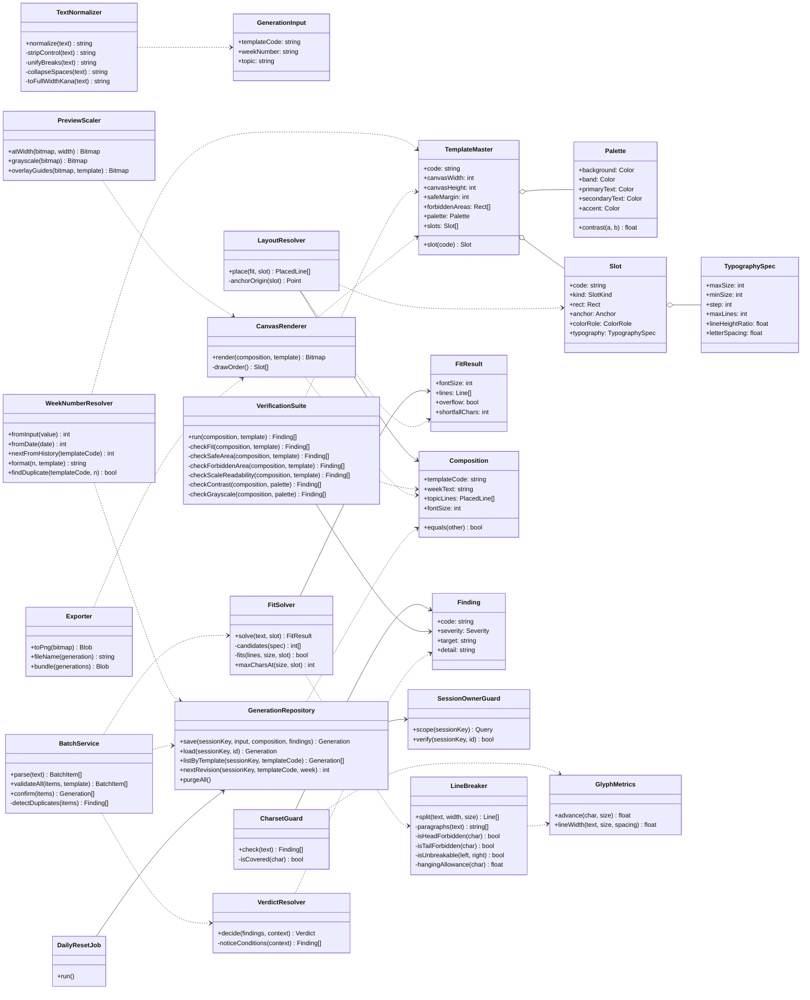
```mermaid
classDiagram
  direction LR

  class TemplateMaster {
    +code: string
    +canvasWidth: int
    +canvasHeight: int
    +safeMargin: int
    +forbiddenAreas: Rect[]
    +palette: Palette
    +slots: Slot[]
    +slot(code) Slot
  }

  class Palette {
    +background: Color
    +band: Color
    +primaryText: Color
    +secondaryText: Color
    +accent: Color
    +contrast(a, b) float
  }

  class Slot {
    +code: string
    +kind: SlotKind
    +rect: Rect
    +anchor: Anchor
    +colorRole: ColorRole
    +typography: TypographySpec
  }

  class TypographySpec {
    +maxSize: int
    +minSize: int
    +step: int
    +maxLines: int
    +lineHeightRatio: float
    +letterSpacing: float
  }

  class GenerationInput {
    +templateCode: string
    +weekNumber: string
    +topic: string
  }

  class TextNormalizer {
    +normalize(text) string
    -stripControl(text) string
    -unifyBreaks(text) string
    -collapseSpaces(text) string
    -toFullWidthKana(text) string
  }

  class CharsetGuard {
    +check(text) Finding[]
    -isCovered(char) bool
  }

  class WeekNumberResolver {
    +fromInput(value) int
    +fromDate(date) int
    +nextFromHistory(templateCode) int
    +format(n, template) string
    +findDuplicate(templateCode, n) bool
  }

  class GlyphMetrics {
    +advance(char, size) float
    +lineWidth(text, size, spacing) float
  }

  class LineBreaker {
    +split(text, width, size) Line[]
    -paragraphs(text) string[]
    -isHeadForbidden(char) bool
    -isTailForbidden(char) bool
    -isUnbreakable(left, right) bool
    -hangingAllowance(char) float
  }

  class FitSolver {
    +solve(text, slot) FitResult
    -candidates(spec) int[]
    -fits(lines, size, slot) bool
    +maxCharsAt(size, slot) int
  }

  class FitResult {
    +fontSize: int
    +lines: Line[]
    +overflow: bool
    +shortfallChars: int
  }

  class LayoutResolver {
    +place(fit, slot) PlacedLine[]
    -anchorOrigin(slot) Point
  }

  class Composition {
    +templateCode: string
    +weekText: string
    +topicLines: PlacedLine[]
    +fontSize: int
    +equals(other) bool
  }

  class VerificationSuite {
    +run(composition, template) Finding[]
    -checkFit(composition, template) Finding[]
    -checkSafeArea(composition, template) Finding[]
    -checkForbiddenArea(composition, template) Finding[]
    -checkScaleReadability(composition, template) Finding[]
    -checkContrast(composition, palette) Finding[]
    -checkGrayscale(composition, palette) Finding[]
  }

  class VerdictResolver {
    +decide(findings, context) Verdict
    -noticeConditions(context) Finding[]
  }

  class Finding {
    +code: string
    +severity: Severity
    +target: string
    +detail: string
  }

  class CanvasRenderer {
    +render(composition, template) Bitmap
    -drawOrder() Slot[]
  }

  class PreviewScaler {
    +atWidth(bitmap, width) Bitmap
    +grayscale(bitmap) Bitmap
    +overlayGuides(bitmap, template) Bitmap
  }

  class Exporter {
    +toPng(bitmap) Blob
    +fileName(generation) string
    +bundle(generations) Blob
  }

  class BatchService {
    +parse(text) BatchItem[]
    +validateAll(items, template) BatchItem[]
    +confirm(items) Generation[]
    -detectDuplicates(items) Finding[]
  }

  class GenerationRepository {
    +save(sessionKey, input, composition, findings) Generation
    +load(sessionKey, id) Generation
    +listByTemplate(sessionKey, templateCode) Generation[]
    +nextRevision(sessionKey, templateCode, week) int
    +purgeAll()
  }

  class SessionOwnerGuard {
    +scope(sessionKey) Query
    +verify(sessionKey, id) bool
  }

  class DailyResetJob {
    +run()
  }

  TemplateMaster o-- Palette
  TemplateMaster o-- Slot
  Slot o-- TypographySpec
  TextNormalizer ..> GenerationInput
  CharsetGuard ..> GlyphMetrics
  CharsetGuard --> Finding
  LineBreaker ..> GlyphMetrics
  FitSolver ..> LineBreaker
  FitSolver --> FitResult
  LayoutResolver ..> FitResult
  LayoutResolver ..> Slot
  LayoutResolver --> Composition
  WeekNumberResolver ..> TemplateMaster
  WeekNumberResolver ..> GenerationRepository
  VerificationSuite ..> Composition
  VerificationSuite ..> TemplateMaster
  VerificationSuite --> Finding
  VerdictResolver ..> Finding
  CanvasRenderer ..> Composition
  CanvasRenderer ..> TemplateMaster
  PreviewScaler ..> CanvasRenderer
  Exporter ..> CanvasRenderer
  BatchService ..> FitSolver
  BatchService ..> VerdictResolver
  BatchService ..> GenerationRepository
  GenerationRepository --> SessionOwnerGuard
  GenerationRepository ..> Composition
  DailyResetJob --> GenerationRepository
```

---

## 18. 状態遷移図

### 18.1 生成

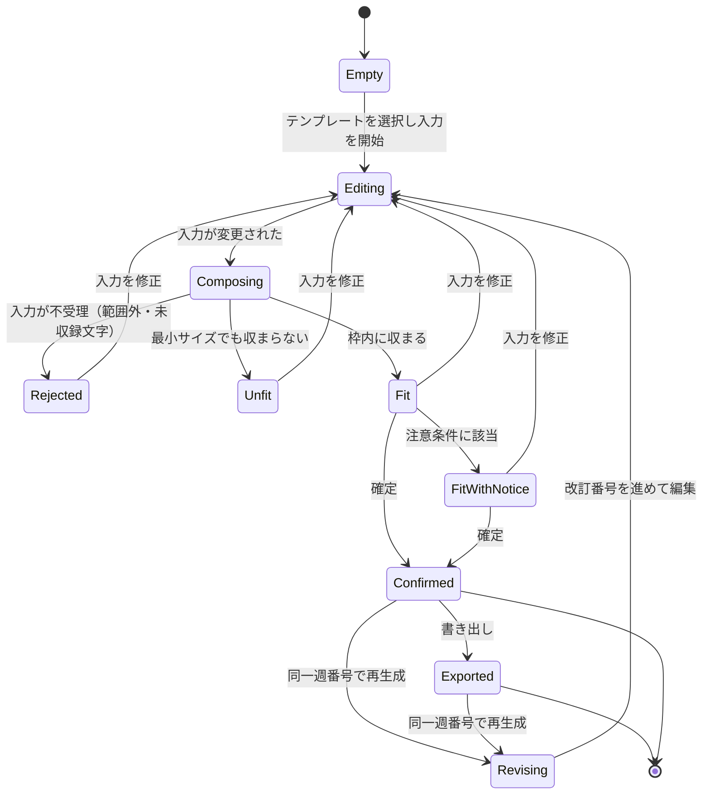
```mermaid
stateDiagram-v2
  [*] --> Empty
  Empty --> Editing : テンプレートを選択し入力を開始
  Editing --> Composing : 入力が変更された
  Composing --> Rejected : 入力が不受理（範囲外・未収録文字）
  Composing --> Unfit : 最小サイズでも収まらない
  Composing --> Fit : 枠内に収まる
  Rejected --> Editing : 入力を修正
  Unfit --> Editing : 入力を修正
  Fit --> FitWithNotice : 注意条件に該当
  FitWithNotice --> Editing : 入力を修正
  Fit --> Editing : 入力を修正
  Fit --> Confirmed : 確定
  FitWithNotice --> Confirmed : 確定
  Confirmed --> Exported : 書き出し
  Confirmed --> Revising : 同一週番号で再生成
  Exported --> Revising : 同一週番号で再生成
  Revising --> Editing : 改訂番号を進めて編集
  Exported --> [*]
  Confirmed --> [*]
```

### 18.2 話題の入力

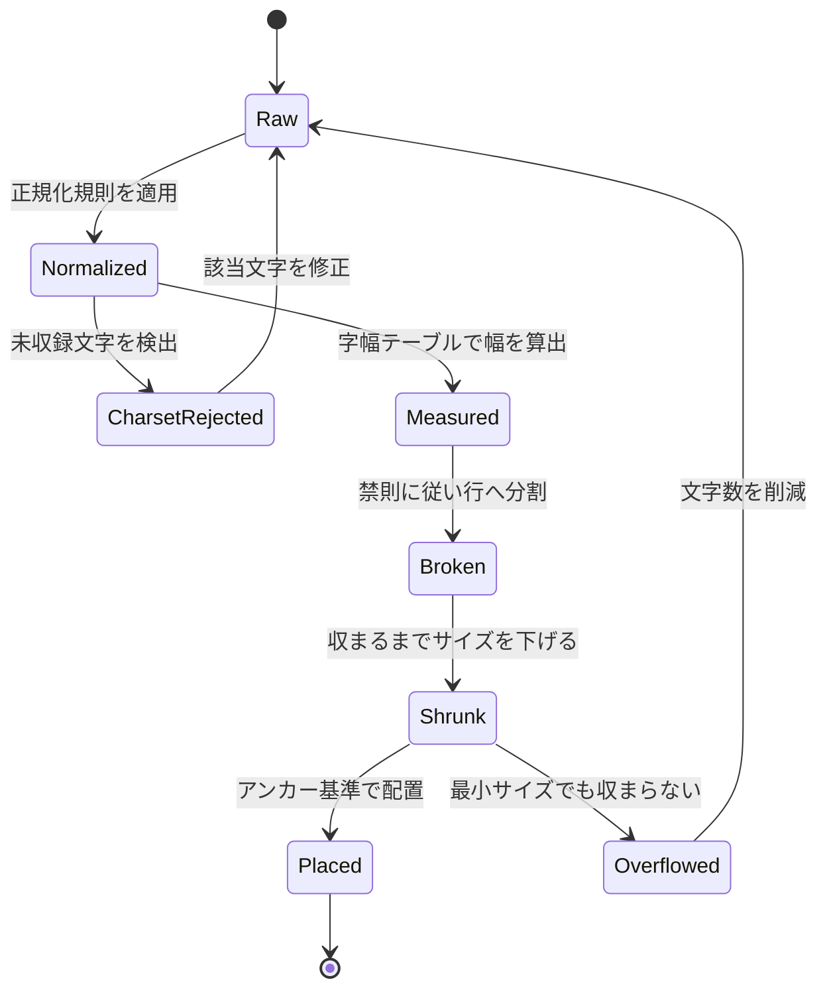
```mermaid
stateDiagram-v2
  [*] --> Raw
  Raw --> Normalized : 正規化規則を適用
  Normalized --> CharsetRejected : 未収録文字を検出
  Normalized --> Measured : 字幅テーブルで幅を算出
  CharsetRejected --> Raw : 該当文字を修正
  Measured --> Broken : 禁則に従い行へ分割
  Broken --> Shrunk : 収まるまでサイズを下げる
  Shrunk --> Placed : アンカー基準で配置
  Shrunk --> Overflowed : 最小サイズでも収まらない
  Overflowed --> Raw : 文字数を削減
  Placed --> [*]
```

### 18.3 一括ジョブ

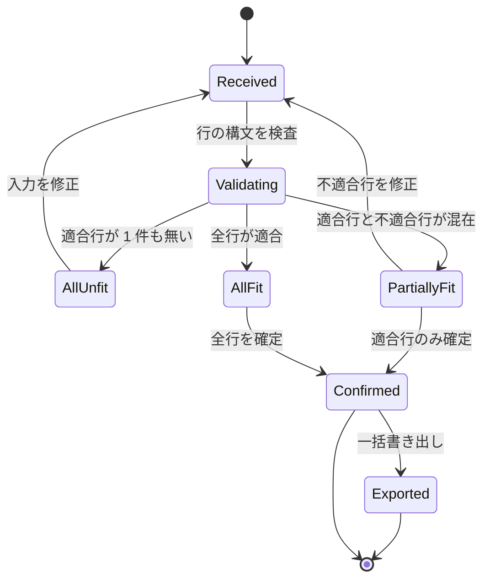
```mermaid
stateDiagram-v2
  [*] --> Received
  Received --> Validating : 行の構文を検査
  Validating --> AllUnfit : 適合行が 1 件も無い
  Validating --> PartiallyFit : 適合行と不適合行が混在
  Validating --> AllFit : 全行が適合
  AllUnfit --> Received : 入力を修正
  PartiallyFit --> Received : 不適合行を修正
  PartiallyFit --> Confirmed : 適合行のみ確定
  AllFit --> Confirmed : 全行を確定
  Confirmed --> Exported : 一括書き出し
  Exported --> [*]
  Confirmed --> [*]
```

### 18.4 週番号

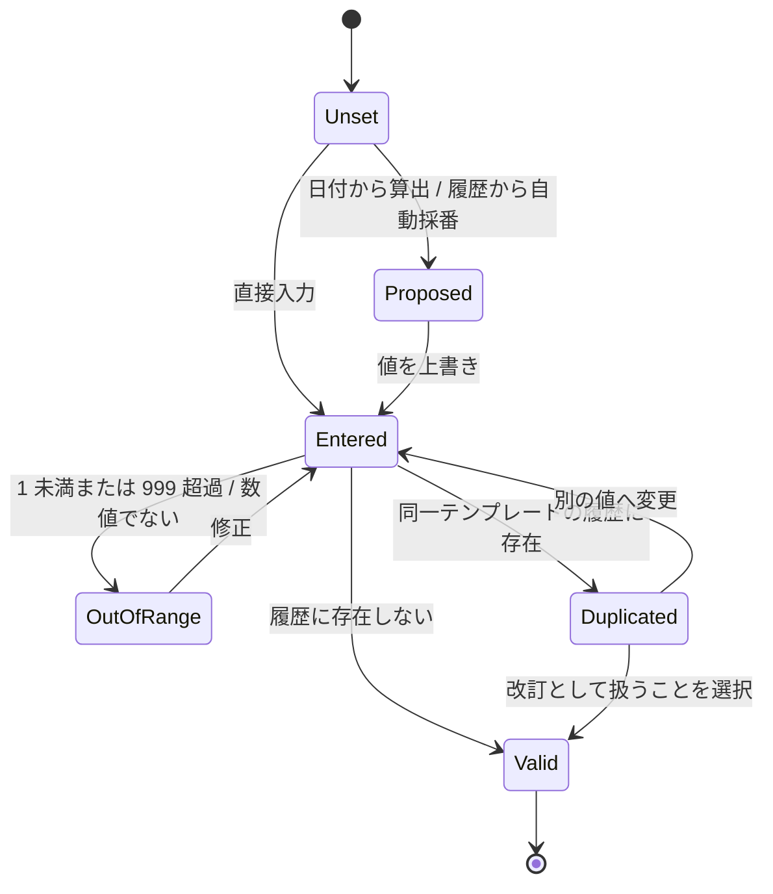
```mermaid
stateDiagram-v2
  [*] --> Unset
  Unset --> Proposed : 日付から算出 / 履歴から自動採番
  Unset --> Entered : 直接入力
  Proposed --> Entered : 値を上書き
  Entered --> OutOfRange : 1 未満または 999 超過 / 数値でない
  OutOfRange --> Entered : 修正
  Entered --> Duplicated : 同一テンプレートの履歴に存在
  Entered --> Valid : 履歴に存在しない
  Duplicated --> Valid : 改訂として扱うことを選択
  Duplicated --> Entered : 別の値へ変更
  Valid --> [*]
```

---

## 19. ユースケース図

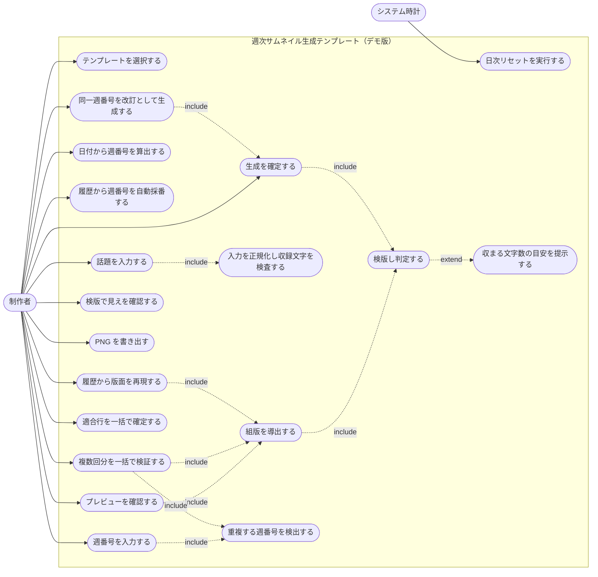
```mermaid
flowchart LR
  OP(["制作者"])
  CK(["システム時計"])

  subgraph SYS["週次サムネイル生成テンプレート（デモ版）"]
    U1(["テンプレートを選択する"])
    U2(["週番号を入力する"])
    U3(["日付から週番号を算出する"])
    U4(["履歴から週番号を自動採番する"])
    U5(["話題を入力する"])
    U6(["プレビューを確認する"])
    U7(["検版で見えを確認する"])
    U8(["生成を確定する"])
    U9(["PNG を書き出す"])
    U10(["複数回分を一括で検証する"])
    U11(["適合行を一括で確定する"])
    U12(["履歴から版面を再現する"])
    U13(["同一週番号を改訂として生成する"])
    U14(["日次リセットを実行する"])
    U15(["入力を正規化し収録文字を検査する"])
    U16(["組版を導出する"])
    U17(["検版し判定する"])
    U18(["重複する週番号を検出する"])
    U19(["収まる文字数の目安を提示する"])
  end

  OP --> U1
  OP --> U2
  OP --> U3
  OP --> U4
  OP --> U5
  OP --> U6
  OP --> U7
  OP --> U8
  OP --> U9
  OP --> U10
  OP --> U11
  OP --> U12
  OP --> U13
  CK --> U14

  U5 -.->|"include"| U15
  U6 -.->|"include"| U16
  U16 -.->|"include"| U17
  U17 -.->|"extend"| U19
  U2 -.->|"include"| U18
  U8 -.->|"include"| U17
  U10 -.->|"include"| U16
  U10 -.->|"include"| U18
  U12 -.->|"include"| U16
  U13 -.->|"include"| U8
```

---

## 20. 非機能要件

| 区分 | 要件 |
|---|---|
| 実装方式 | 1 issue のワンショットで実装する |
| 外部通信 | 外部サービスへのネットワーク越しの呼び出しを行わない。フォント・字幅テーブルを含む全資産を同一オリジンから配信する |
| 決定性 | 同一入力から同一の組版結果（採用サイズ・行分割・配置）が得られること。乱数・現在時刻・実行回数に依存しないこと |
| 環境非依存 | 組版計算を描画環境の文字計測 API に依存させず、同梱の字幅テーブルのみから行うこと |
| 版面不変 | 入力の内容によってスロット枠の位置・寸法が変化しないこと。可変スロットの伸縮方向がアンカーの反対方向の 1 方向に限られること |
| 再現性 | 履歴に保存した組版結果からの再描画が、確定時の版面と一致すること |
| 応答 | 入力の変更に対して同期的に再描画し、バックグラウンド処理・遅延反映を持たないこと |
| 整合性 | 確定・改訂・一括確定は生成単位で直列化し、改訂番号が重複しないこと |
| 追跡性 | 判定に至った指摘を、検版項目および入力項目と対応づけて保持すること |
| 表示 | 単票生成画面は、プレビュー・組版情報・判定を縦スクロールなしで同時に確認できること |

---

## 21. セキュリティ・個人情報

**セキュリティ**

- 認証・認可を設計に組み込まない
- セッション管理（Cookie ＋ SQLite）を用い、セッションキーをオーナーキーとして全テーブルに付与する
- セッションをまたいだ DB レコードの参照・操作を行えないこと。生成 ID を知っていてもセッションキーが一致しなければ到達できないこと
- Bot 対策はハニーポット方式で行う。単票生成・一括生成の各フォームに不可視の入力欄を設け、値が入っている送信は受理しない。reCAPTCHA を用いない
- テンプレートコード・週番号はマスタ値と範囲に照合し、範囲外の値を持つ要求は受理しない
- 話題は表示・描画のみに用い、文字列として解釈・実行しないこと。書き出しファイル名に利用者の入力文字列を含めないこと
- 一括入力の行数・1 行あたりの長さに上限を設け、上限超過の要求を受理しないこと

**個人情報**

| 項目 | 扱い |
|---|---|
| 氏名・ニックネーム | 使用しない。制作者を識別する項目を持たない |
| メールアドレス | 使用しない |
| 生年月日・住所・電話番号 | 使用しない。週番号算出に用いる日付は入力のみで保存しない |
| 話題の文字列 | 任意の入力であり、実在の個人が特定できる情報を含めないよう画面で案内する |
| セッションキー | 端末識別子として扱う |

---

## 22. 運用要件

| 項目 | 内容 |
|---|---|
| DB | SQLite（D1）。デプロイ先を問わず SQLite を用いる |
| 日次リセット | JST 03:00 に生成・組版行・指摘・一括ジョブ・行・書き出し記録を削除する。Cron Triggers で実行する |
| 同梱データ | テンプレート・パレット・禁則規則・正規化規則・フォント・字幅テーブルはアプリケーションに同梱し、リセットの対象外とする |
| フォント | 再配布可能なライセンスのものをサブセット化して同梱し、ライセンス表記を画面に掲示する |
| 測定 | 行わない |
| 保守・監視 | 行わない |

---

## 23. 対応環境と制約

| 項目 | 内容 |
|---|---|
| 対応ブラウザ | Canvas API と同梱フォントの読み込みに対応した最新世代のデスクトップ向けブラウザおよびモバイルブラウザ |
| 対応端末 | デスクトップを主とし、モバイルではプレビューを版面比率のまま縮小して表示する |
| 画像の扱い | 生成画像はサーバに保存しない。利用者が書き出したファイルのみが手元に残る |
| データの寿命 | 日次リセットにより、生成履歴は当日限りで消去される。その旨を画面に常時表示する |
| 前提 | テンプレート（版面・配色・配置）は固定であり、利用者による編集を受け付けない。可変要素は週番号と話題の 2 つに限られる |
| 文字の制約 | 同梱フォントの収録範囲外の文字（絵文字を含む）は使用できない |
